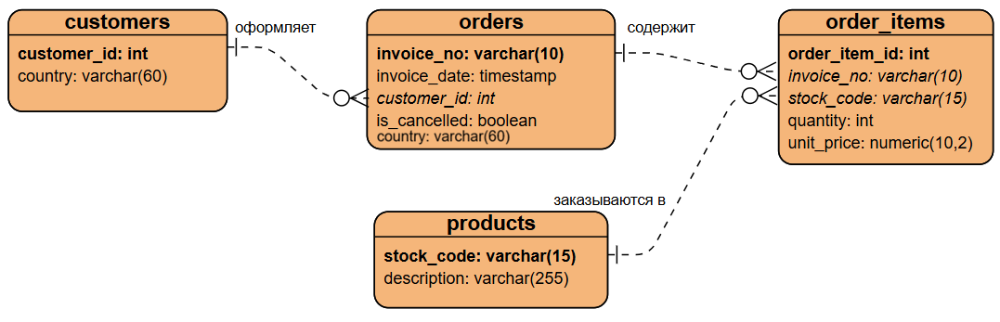
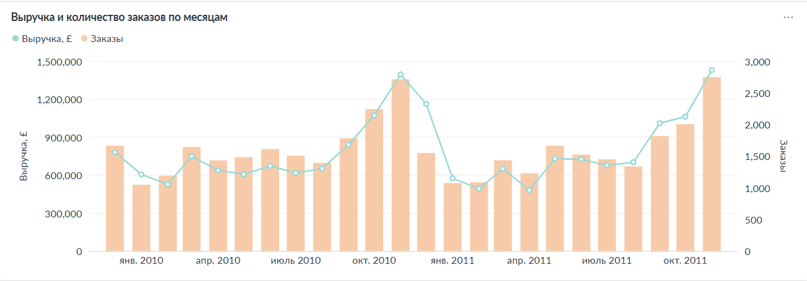
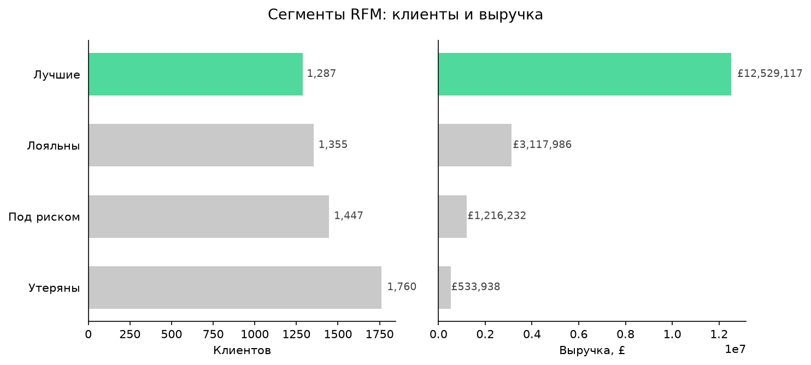
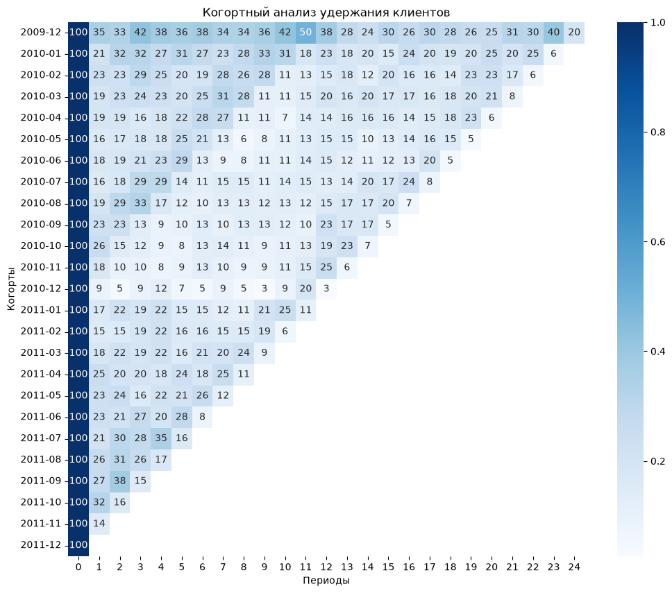
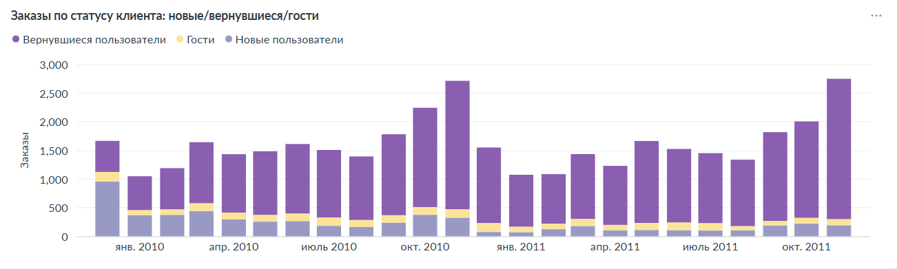
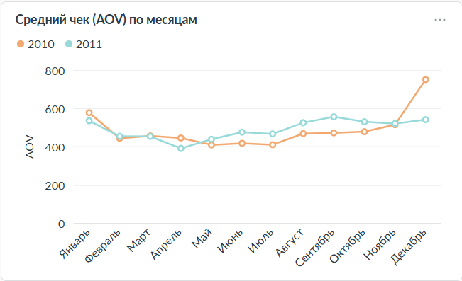
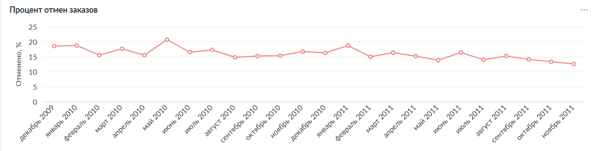
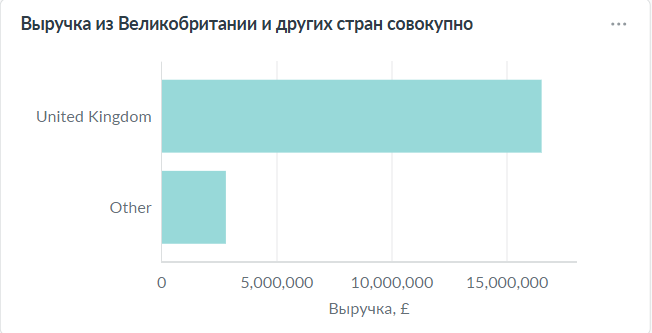
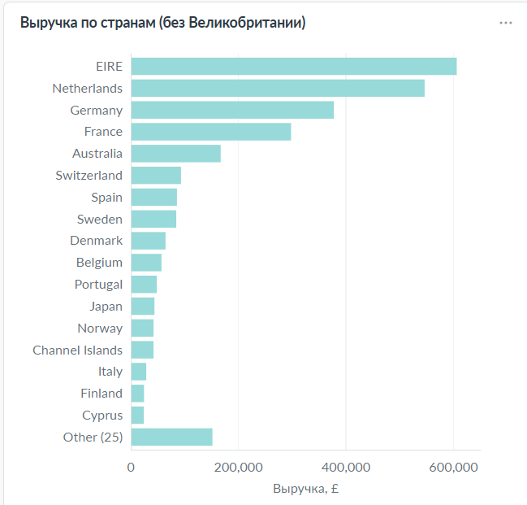
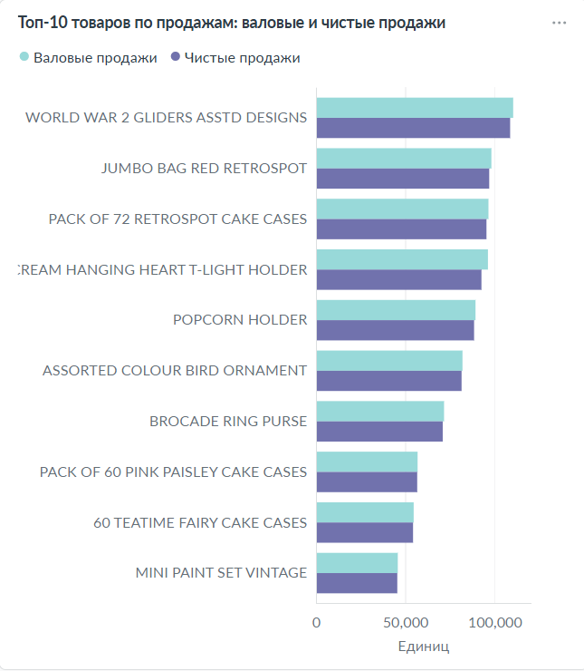

# Анализ Online Retail

## Содержание

- [Задача](#задача)
- [Стек технологий](#стек-технологий)
- [Dashboard](#dashboard)
- [О датасете](#о-датасете)
- [Очистка данных](#очистка-данных)
- [ER-диаграмма](#er-диаграмма)
- [Анализ и метрики](#анализ-и-метрики)
  - [Выручка и количество заказов по месяцам](#выручка-и-количество-заказов-по-месяцам)
  - [RFM-сегментация](#rfm-сегментация)
  - [Когортный анализ](#когортный-анализ)
  - [Заказы по статусу клиента](#заказы-по-статусу-клиента-новые--вернувшиеся--гости)
  - [Средний чек (AOV)](#средний-чек-aov)
  - [Процент отмен](#процент-отмен)
  - [География](#география)
  - [Топ-10 товаров](#топ-10-товаров)
- [Выводы](#выводы)

## Задача

Понять, за счёт чего складывается выручка за 2009–2011 и как устроена клиентская база британского онлайн-ритейлера подарков и сувениров.

Этапы:

1. Очистить транзакции и собрать витрину в PostgreSQL.
2. Посчитать следующие метрики: выручка, заказы, средний чек, доля отмен, география заказов, топ товаров.
3. Разобрать клиентскую базу: новые / вернувшиеся / гости, RFM-сегменты, удержание по когортам.
4. Собрать дашборд в Metabase.
5. Зафиксировать выводы.

## Стек технологий

PostgreSQL · SQL · Python (pandas, matplotlib, seaborn) · Metabase

## Dashboard

Ссылка на дашборд Metabase: \
 [https://data.tarianik.dev/public/dashboard/f903cd3c-e7ab-42c2-8b77-34a2a1051889](https://data.tarianik.dev/public/dashboard/f903cd3c-e7ab-42c2-8b77-34a2a1051889)

## О датасете

[Online Retail II (UCI)](https://archive.ics.uci.edu/dataset/502/online+retail+ii) — все транзакции британского онлайн-магазина без офлайн-точек с **01.12.2009** по **09.12.2011**.

- **1 067 371** строк, **8** столбцов: номер счёта, артикул, описание, количество, дата, цена, клиент, страна.
- Декабрь 2011 неполный (данные обрываются 9-го числа): в графиках с помесячной динамикой либо исключён, либо оговорен.

## Очистка данных

Сырые данные из [online_retail_II.csv](online_retail_II.csv) загружены в промежуточную таблицу `stg`. Правила проверки — в [sql/data_checks.sql](sql/data_checks.sql). В представление [`stg_valid`](sql/create_view.sql) попадают только строки с валидным счётом, товарным кодом, описанием и `unit_price > 0`. Битые счета из [sql/bad_invoices.sql](sql/bad_invoices.sql) отсекаются при [`INSERT`](sql/insert.sql).

| Правило                                                 | Запрос                                   | Строк      | Комментарий                                                                                                                                                            |
| ------------------------------------------------------- | ---------------------------------------- | ---------- | ---------------------------------------------------------------------------------------------------------------------------------------------------------------------- |
| `unit_price <= 0`                                       | [data_checks.sql](sql/data_checks.sql)   | 6207       | Бесплатные позиции; искажают топ товаров и средний чек, исключены                                                                                                      |
| `stock_code` не соответствует `^\d+[a-zA-Z]\*$`         | [data_checks.sql](sql/data_checks.sql)   | 6094       | Не товары: почта (`POST`, `DOT`), скидки (`D`), ручные корректировки (`M`) и т. п.                                                                                     |
| `description IS NULL`                                   | [data_checks.sql](sql/data_checks.sql)   | 4382       | У всех таких строк `unit_price = 0` — это битые записи, не продажи                                                                                                     |
| `quantity < 0` и `invoice_no` без префикса `C`          | [data_checks.sql](sql/data_checks.sql)   | 3457       | Из 22 950 строк с отрицательным количеством 19 493 — отмены (`C…`), они были оставлены. Остальные — списания (`lost` / `damaged` / `missing` / `NULL`), были исключены |
| Один `invoice_no` с разными датой, клиентом или страной | [bad_invoices.sql](sql/bad_invoices.sql) | 83 счёта   | Битые записи; не были добавлены в таблицы</code>                                                                                                                       |
| `invoice_no` не соответствует `^C?\d{6}$`               | [data_checks.sql](sql/data_checks.sql)   | 6          | Списания долга, не заказы                                                                                                                                              |
| `customer_id IS NULL`                                   | [data_checks.sql](sql/data_checks.sql)   | ~22% строк | Гостевые покупки **сохранены** в заказах; в RFM и когортах не участвуют                                                                                                |

Финальная схема: таблицы `customers`, `orders`, `products`, `order_items`(создание: [sql/create_tables.sql](sql/create_tables.sql), загрузка данных: [sql/insert.sql](sql/insert.sql)). В таблицу `orders` добавлен столбец `is_cancelled` для обозначения отменённых заказов (`invoice_no` с префиксом `C`). В `order_items` возвраты хранятся не отдельной категорией, а той же строкой транзакции с отрицательным `quantity`, поэтому `SUM(quantity * unit_price)` по всем строкам компенсирует возврат из выручки и даёт **чистую выручку** (net revenue).

Там, где нужна **валовая выручка** (gross revenue, т.е. выручка до возвратов, показывающая исходный спрос), используется `FILTER (WHERE NOT is_cancelled)`, чтобы исключить строки с возвратами из суммы.

## ER-диаграмма

Клиент оформляет заказы, заказ содержит позиции, товар заказывается в позициях. Страна хранится и у клиента, и у заказа (страна конкретной отгрузки). Гостевой заказ — `orders.customer_id IS NULL`.

## Анализ и метрики

На графиках представлена чистая выручка (`quantity * unit_price`, отмены уменьшают сумму). Заказ — уникальный `invoice_no` без отмены.

### Выручка и количество заказов по месяцам

SQL: [revenue_and_orders.sql](sql/metabase_widgets/revenue_and_orders.sql)

Форма графиков для 2010 и 2011 одна и та же: относительно ровное первое полугодие, рост с сентября, пик в ноябре, обвал в январе.

Наибольшие выручка и продажи наблюдаются в ноябре: в 2010 выручка около £1,39 млн при 2712 заказов, в 2011 чуть выше (~£1,43 млн при 2748 заказов). Это примерно **+78% и +82%** к средней. Это объясняется увеличением спроса перед Рождеством. Январь 2011 падает примерно до £575 тыс. на 1074 заказов: после праздников наблюдается уменьшение примерно в 2,5 раз.

В 2011 году картина почти не меняется: он повторяет сезонность 2010 на том же уровне. Без притока новых клиентов рост года выглядит как повтор того же цикла, где основной вклад в четвёртом квартале.

### RFM-сегментация

Python: [notebooks/RFM.ipynb](notebooks/RFM.ipynb)

_RFM и когорты считаются только по идентифицированным клиентам (78% заказов)._
Recency — дни от последней покупки до конца периода анализа; Frequency — число счетов; Monetary — сумма выручки. Баллы R/F/M — оценки от 1 до 5, которые показывают, в какой квинтиль попал клиент по каждому из трёх показателей. Сегмент определяется по сумме баллов: Утеряны / Под риском / Лояльны / Лучшие.

| Сегмент    | Клиентов |    Выручка |
| ---------- | -------- | ---------: |
| Лучшие     | 1287     | £12,53 млн |
| Лояльны    | 1355     |  £3,12 млн |
| Под риском | 1447     |  £1,22 млн |
| Утеряны    | 1760     |  £0,53 млн |

**22% клиентов ("лучшие") дают 72% выручки.** "Лояльные" добавляют ещё ~18%: их меньше по вкладу, чем "лучших", но заметно больше, чем остальных. "Утерянные" — самая большая группа (~30%) и всего ~3% выручки: много разовых и давно ничего не купивших покупателей. "Под риском" — покупали недавно, но редко или на небольшие суммы.

### Когортный анализ

Python: [notebooks/cohort.ipynb](notebooks/cohort.ipynb)

На вертикальной оси расположены сами когорты — месяцы первой покупки пользователей. На горизонтальной оси расположен "возраст" когорты — количество месяцев, прошедших с момента первой покупки (0 = месяц регистрации). В ячейках — доли клиентов когорты, которые в данном месяце сделали заказ.

После месяца 0 удержание почти у всех когорт падает до ~10–25% и дальше не увеличивается. Исключение — когорта **2009-12**: после просадки до ~35% она сохраняет 30–40%, на 11-м месяце (ноябрь 2010) поднимается до **50%** и к концу всё еще около 40%. Это ядро первых праздничных клиентов плюс годовая сезонность.

Когорта **2010-10** (и соседние осенние 2010) в следующих месяцах возвращается заметно хуже остальных: похоже на приток разовых предпраздничных покупателей, которые не стали постоянной клиенсткой базой. Осенью 2011 удержание чуть выше (27–32% в периоде 1). Эти когорты небольшие, но удержание лучше, чем в середине 2010 года.

### Заказы по статусу клиента: новые / вернувшиеся / гости

SQL: [orders_by_client.sql](sql/metabase_widgets/orders_by_client.sql)

В начале наблюдаемого периода новые клиенты представляют заметную долю. К 2011 их доля сжимается до тонкой полоски, а пик в ноябре почти целиком из вернувшимихся. Гости — стабильно небольшая прослойка на всём графике: заказы есть, но на динамику выручки почти не влияют.

Это позволяет дополнить выводы из графика выручки: заказы в 2011 не просели относительно 2010 не за счёт притока новых, а потому что база повторно покупает. В первые месяцы 2011 приток новых падает в несколько раз к началу 2010. Это совпадает с RFM: выручку делают "лучшие" и "лояльные".

### Средний чек (AOV)

SQL: [aov.sql](sql/metabase_widgets/aov.sql)

  

Сравнение 2010 и 2011 по месяцам. Помесячно средний чек обычно держится в диапазоне **£400–560**: в январе он выше (~£540–580), в феврале проседает к (~£450). С мая по ноябрь 2011 чек выше, чем в те же месяцы 2010, при похожей сезонности заказов.

В декабре 2010 рост примерно до **£750**; декабрь 2011 (~£540) с ним сравнивать нельзя: в датасете только 1–9 декабря, без основной праздничной недели. В апреле 2011 — обвал ниже £400.

Учитывая выручку, можно сказать, что её пики в ноябре — это увеличившийся объём заказов, а не выросший чек.

### Процент отмен

SQL: [cancellation_rate.sql](sql/metabase_widgets/cancellation_rate.sql)

Доля отменённых счетов от всех счетов месяца. В начале исследуемого периода процент отмен ~18%, пик — в мае 2010 **~20%**, затем падение до ~15% в августе, медленный рост в Q4 с пиком в январе 2011 (~19%). Дальше тренд вниз, к ноябрю 2011 — около **12–13%**.

### География

SQL: [UK vs остальные](sql/metabase_widgets/revenue_no_uk.sql) · [по странам без UK](sql/metabase_widgets/revenue_with_uk.sql)

  

  

UK даёт примерно **£16,5 млн**, все прочие страны вместе — около **£3 млн**: рынок UK даёт **85%** всей чистой выручки.

Вне UK лидируют Ирландия (~£600+ тыс.), Нидерланды (~£550 тыс.), затем Германия и Франция. Австралия, будучи шестой по выручке (~£160 тыс.) и одним из наиболее удаленных регионов, сопоставима с корзиной "прочие 25 стран" (~£160 тыс.).

### Топ-10 товаров

SQL: [top_10_orders.sql](sql/metabase_widgets/top_10_orders.sql)

  

Чистые продажи на графике — это сумма без отменённых счетов, валовые — сумма по всем строкам (отмены с отрицательным `quantity` уменьшают сумму), поэтому столбец с чистыми продажами длиннее.

Самый продаваемый товар — `WORLD WAR 2 GLIDERS ASSTD DESIGNS` (~100 тыс.). Следующие — большие пакеты, формы для кексов, подсвечники, подставки для попкорна. Три позиции из десяти — различные формы для кексов (CAKE CASES). Объём после 7-го места падает до ~50 тыс. штук.

## Выводы

1. **Роста в 2011 году нет.** Пик выручки и заказов — ноябрь; 2011 повторяет форму 2010, а не открывает новую траекторию.
2. **2011 держится на вернувшихся/постоянных клиентах.** Приток новых в 2011 сильно упал; гости на динамику почти не влияют.
3. **Концентрация выручки:** 22% "лучших" приносят 72% выручки; ~85% чистой выручки — из UK.
4. **Когорты:** После первой покупки большинство не возвращается; выше удержание у самых первых клиентов (особенно 2009-12) и в периоды, совпадающие со следующим Q4.
5. **Средний чек, отмены, топ товаров** Средний чек относительно стабилен, доля отмен к концу периода снижается. Изменение выручки в основном идёт через число заказов, а не через чек. Самые продаваемые товары сохраняют объём и после учёта возвратов.
