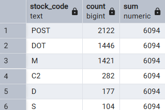

# Анализ Online Retail

# Задача

Необходимо провести

## Стек технологий

PostgreSQL | SQL | Python | Metabase

## Dashboard

Ссылка на дашборд Metabase: \
 [data.tarianik.dev](https://data.tarianik.dev)

## О датасете

Ссылка на датасет: \
 [https://archive.ics.uci.edu/dataset/502/online+retail+ii](https://archive.ics.uci.edu/dataset/502/online+retail+ii) \
Строк: 1067371 \
Столбцов: 8 \
Online Retail II содержит все транзакции, совершенные зарегистрированной в Великобритании онлайн-компанией, не имеющей розничных магазинов, в период с 01.12.2009 по 09.12.2011.

## Очистка данных

Была создана промежуточная таблица с сырыми данными из csv-файла и VIEW stg_valid, куда по мере очистки данных добавлялись условия в WHERE для формирования финальной таблицы. SQL-запросы, отфильтровывающие ненужные данные находятся в файле [data_checks.sql](data_checks.sql) и представлены в следующей таблице:

<table>
    <tr>
        <td>Правило</td>
        <td>Ссылка</td>
        <td>Строк</td>
        <td>Комментарии</td>
    </tr>
    <tr>
        <td>invoice_no не соответствует ^C?\d{6}$</td>
        <td>[data_checks.sql](online_retail/sql/data_checks.sql#L1)</td>
        <td>6</td>
        <td>Это списания долга, не транзакции</td>
    </tr>
    <tr>
        <td>stock_code не соответствует ^\d+[a-zA-Z]\*$</td>
        <td>[data_checks.sql](online_retail/sql/data_checks.sql#L6)</td>
        <td>2122</td>
        <td>Это почтовые расходы (POST), непривязанные к товарам скидки (D) и т. п., транзакций нет</td>
    </tr>
        <tr>
        <td>stock_code не соответствует ^\d+[a-zA-Z]\*$</td>
        <td>[data_checks.sql](online_retail/sql/data_checks.sql#L6)</td>
        <td>2122</td>
        <td>Это почтовые расходы (POST), непривязанные к товарам скидки (D) и т. п., транзакций нет</td>
    </tr>
</table>

1. Столбец `invoice_no` должен представлять собой 6-значное число с возможной буквой "C" в начале в случае, если заказ отменён. Значения, неудовлетворяющие этому условию:
2.

```
SELECT *
FROM stg
WHERE "Invoice" !~ '^(C?\d{6})$';
```

Таких значений 6: это списания долга, не транзакции — они были отфильтрованы.\
Строки `stock_code` должны начинаться с цифры и могут заканчиваться буквами, означающими вариант товара (цвет, размер и т. п.). Остальные значения:

```
SELECT
  stock_code, COUNT(*), SUM(COUNT(*)) OVER()
FROM stg
WHERE
  stock_code !~ '^\d+[a-zA-Z]*$'
GROUP BY stock_code
ORDER BY COUNT(*) DESC
```

 \
Среди них 2122 строк, не являющиеся транзакциями. Это почтовые расходы (POST), непривязанные к товарам скидки (D) и т. п. — они были отфильтрованы.

В датасете 22950 строк с отрицательным `quantity`: из них 19493 строк — отмененные заказы (с префиксом "C"), они были оставлены. Остальные были исключены, так как в `description` содержали либо `null`, либо "lost", "damaged", "missing" и т. п.

## ER-диаграмма


